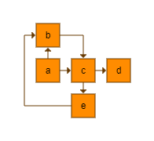
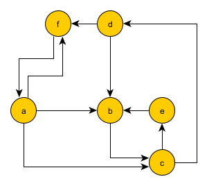

# EXÉRCICIOS

# Tema das questões: Diagrama de Dependência de Classes (DDC)

Este diagrama representa todas as relações de dependência existentes entre as classes de um (pacote de) software.
Uma classe A depende de uma classe B, A -> B, se modificações em B podem requisitar modificações em A.

Dependência é uma relação transitiva. Sejam A, B e C três classes. Podemos afirmar que:

1.   A depende de A
2.   Se A depende de B e B depende de C, então A depende de C
3. Se A referencia B, então A depende de B.

Uma classe A referencia uma classe B, se B aparece, explicitamente na definição/implementação de A. Por exemplo, A pode estender B, ter um campo do tipo B ou um método que referencia B. Mas também é possível que A referencie B implicitamente através de uma classe C. 

(Este texto é um resumo de: http://www.cs.sjsu.edu/faculty/pearce/modules/lectures/ood/metrics/Dependency.htm)

Neste exercício, representamos DDCs como grafos direcionados, onde cada vértice representa uma classe e cada arco uma dependência existente entre duas classes. 
Por simplicidade, os DDCs são criados a partir de uma descrição no formato lista de arestas que pode ser importada de um arquivo através da função [read_edgelist](https://networkx.org/documentation/stable/reference/readwrite/generated/networkx.readwrite.edgelist.read_edgelist.html#networkx.readwrite.edgelist.read_edgelist).
A seguir, temos um exemplo de um DDC construído a partir de uma lista de arcos.

    a b
    a c
    b c
    c d
    c e
    e b

Este tipo de diagrama pode ser exportado em diferentes formatos por ferramentas que realizam este tipo de análise em código. Como exemplo, temos o comando **jdeps** do [JDK](https://docs.oracle.com/javase/9/tools/jdeps.htm) que retorna as dependências de nível de pacote ou nível de classe dos arquivos de classes em Java.

# Questões

## Questão 01: Acomplamento e Instabilidade

Em um software orientado a objetos, classes devem ser coesas. **Coesão** (*cohesion*) é uma medida da força da relação entre os métodos e dados de uma classe e algum propósito ou conceito unificador servido por essa classe. Um atributo relacionado a coesão é o **acomplamento** (*coupling*) que mede diretamente o grau de dependências existentes entre as classes. Quanto maior a coesão das classes, menor o acomplamento.
Um bom design é formado por classes com baixo acomplamento.

Em nível de classe, podemos calcular duas métricas que caracterizam o seu acomplamento com outras classes do DDC:

* *fan_out coupling* (*efferent coupling*) - número de classes das quais uma class *C* depende
* *fan_in coupling* (*afferent coupling*) - número de classes que dependem de uma classe *C*

Mais detalhes sobre estas métricas podem ser vistos nesta referência:
https://gcc.gnu.org/onlinedocs/gcc-4.8.5/gnat_ugn_unw/Coupling-Metrics-Control.html

Construa a função **class_metrics** que recebe um grafo *ddc* e uma classe *c* (um identificador de vértice do grafo) como entrada e retorna uma tupla com as métricas *fan_out* e *fan_in* acima descritas. 

Como exemplo, considere o DDC abaixo. Os valores de *fan_out* e *fan_in* para cada classe são:

    class: a fan_out: 2 fan_in: 0
    class: b fan_out: 1 fan_in: 2
    class: c fan_out: 2 fan_in: 2
    class: d fan_out: 0 fan_in: 1
    class: e fan_out: 1 fan_in: 1

**Arquivos**:
* EP02/src/Q01.py (local onde a função deve ser construída)
* EP02/main_EP01_Q01.py (exemplo de uso da função)

**Testes**:
        python -m unittest -v EP02-2022-2-read_only/test/test_Q01.py

## Questão 02: Vilãs Globais

Chamamos de quebrável global (*global breakable*) uma classe *C* que depende excessivamente de muitas outras classes. Esta classe poderá ser alvo constante de manutenção sempre que algum de seus dependentes for modificado. Por outro lado, chamados de borboleta global (*global butterfly*) uma classe *C* que possui muitos dependentes. A desvantagem de ter uma borboleta global como parte de seu código é que pode se tornar impossível modificar este código completamente, porque mesmo pequenas operações podem requisitar muito esforço com impacto mais amplo nos dependentes. Chamamos de *hub* uma classe que é tanto uma quebrável global quanto uma borboleta global.

Mais detalhes sobre estes conceitos podem ser vistos em:
https://dzone.com/articles/the-silent-villains-of-the-coding-universe-a-revie

Escreva a função **silent_villians** que recebe um grafo *ddc* e retorna uma tupla com listas das classes que podem ser classificadas como quebrável global, borboleta e hub respectivamente, caso existam. Consideramos que uma classe é quebrável global ou borboleta global quando o número de dependências existentes for maior que um certo limiar de tolerância, *threshold* a ser passado como parâmetro para a função.

Como exemplo, considere o DDC abaixo. Para este grafo, considerando *threshold = 1*, a função deve retornar as seguintes listas:

    Global Breakable: [a, c]
    Global Butterfly: [b, c]
    Hub: [c]

**Arquivos**:
* EP02/src/Q02.py (local onde a função deve ser construída)
* EP02/main_EP01_Q02.py (exemplo de uso da função)

**Testes**:
        python -m unittest -v EP02-2022-2-read_only/test/test_Q02.py

## Questão 03: Dependências

O conjunto de todas as dependências de uma classe C é formado por suas dependências diretas e dependências indiretas obtidas por transitividade.

Construa a função **dependencies** que recebe um grafo *ddc*  e uma classe *c* (um identificador de vértice do grafo) como entrada e retorna uma tupla com as listas de dependências diretas e indiretas de uma classe.

Como exemplo, considere o DDC abaixo. Para este grafo, a função deve retornar as seguintes listas:

    Class a - Direta: [b, c] - Indireta: [d, e]
    Class b - Direta: [c] - Indireta: [d, e]
    Class c - Direta: [d, e] - Indireta: [b]
    Class d - Direta: [] - Indireta: []
    Class e - Direta: [b] - Indireta: [c, d]

**Arquivos**:
* EP02/src/Q03.py (local onde a função deve ser construída)
* EP02/main_EP01_Q03.py (exemplo de uso da função)

**Testes**:
        python -m unittest -v EP02-2022-2-read_only/test/test_Q03.py

## Questão 04: Minimum Feedback Set

Dependência circulares (*circular dependencies*) ocorrem quando  dependências entre um conjunto de classes podem ser representadas por um ciclo direcionado em um DDC. Por exemplo, considere as seguintes dependências: A -> B, B -> C, C -> A. Quando o ciclo é simples (não repete classes), chamamos de ciclo de dependência mínimo (*minimum dependency cycle*).
Dependência circular é um anti-padrão de *design*, pois pode causar um efeito dominó onde mudanças locais em uma classe A podem afetar todas as classes no ciclo de dependências, possivelmente de maneira infinita. Dependências circulares devem ser evitadas através do uso de padrões de design, mas são comumente encontradas em sistemas reais e devem ser detectadas e removidas.

Como refatoramento se trata usualmente de uma atividade de alto custo e complexidade, eliminar todas as dependências circulares em um projeto é sempre desafiante. Idealmente, deve-se escolher um conjunto mínimo de dependências a remover a fim de minimizar os custos e esforços necessários. Este conjunto mínimo é conhecido como **Minimum Feedback (Arc) Set (MFS)**. Se um conjunto de arcos *C* é um MFS significa que remover qualquer arco de *C* resulta em um conjunto que não é um MFS. Encontrar MFSs é um problema NP-hard, mas pode ter soluções não ótimas através de heurísticas ou aproximações.

Escreva uma função, **mfs_greedy**, que recebe um *ddc* como entrada e retorna um MFS como uma lista de arcos. A função utiliza a seguinte heurística para determinar o MFS:

 1. *mfs* = []
 2. Encontre o conjunto inicial de ciclos de dependência minimos, *md_cycles*, contendo listas de arcos representando cada ciclo
 3. Repita enquanto *md_cycles* não for vazio

    i.  Escolha um arco *a* que participe da maior quantidade de ciclos em *md_cycles*. No caso de empate, escolha o arco cujo vértice de origem tiver maior *fan_out*. Para desempate, considere o arco com vértice destino com maior *fan_in*. Por fim, se ainda houver empate, considere a ordenação lexicográfica das tuplas. Adicione *a* a *mfs*.
    
    ii. Retire de *md_cycles* todos os ciclos que contêm *a*.

4. Retorne *mfs*.  

Como exemplo, considere o DDC abaixo. Neste DDC, existem os seguintes ciclos de dependência mínimos:

    [(d, f), (f, a), (a, c), (c, d)],
    [(d, f), (f, a), (a, b), (b, c), (c, d)], 
    [(d, b), (b, c), (c, d)], 
    [(f, a), (a, f)], 
    [(e, b), (b, c), (c, e)]

Neste caso, há um empate na maior quantidade de ocorrências: os arcos (f,a), (c,d) e (b,c) ocorrem em três ciclos. Assim, escolhemos o arco (c,d) para remover do DDC porque c possui maior fan_out do que f e b (primeiro critário de desempate). Este arco é então adicionado ao MFS. Após remover os ciclos que o contém, ficamos com os seguintes ciclos em *md_cycles*: 

    [(f, a), (a, f)], 
    [(e, b), (b, c), (c, e)]]

Neste caso, todos os arcos possuem o mesmo número de ocorrências nos ciclos. Sendo assim, escolhemos o arco (a,f) para compor o MFS porque a é a classe com maior fan_out. Ficamos então com o ciclo:

    [(e, b), (b, c), (c, e)]]

Agora, temos mais uma vez o mesmo número de ocorrências. Mas c tem maior valor de fan_out. Então, o arco (c,e) será adicionado ao MFS.

O MFS resultante é:

    [(c, d), (a, f), (c, e)]

Note que esta heurística não é um algoritmo. Poderão haver casos em que o MFS encontrado não seja o mínimo. Trata-se apenas de uma aproximação a qual deve ser seguida na implementação de *mfs_greedy*. 

**Arquivos**:
* EP02/src/Q04.py (local onde a função deve ser construída)
* EP02/main_EP01_Q04.py (exemplo de uso da função)

**Testes**:
        python -m unittest -v EP02-2022-2-read_only/test/test_Q04.py

## Questão 05 : Estimativa de Custo de Manutenção

Podemos encontrar em um DDC padrões de dependência ainda mais complexos do que os ciclos mínimos. Duas ou mais classes podem ser mutuamente dependentes através de dependências diretas ou indiretas. Chamamos este conjunto de classes de *tangle*. Em um tangle, podemos encontrar um ou mais ciclos de dependência mínimos. A Figura abaixo, mostra um DDC que contém um *tangle* formado pelas classes a, b, c, d, e, f. 
Um tangle em um DDC pode ser definido com um componente forte do grafo.

O custo de modificar uma classe que faz parte de ciclos ou tangles pode ser muito alto.

Construa a função **change_costs_factor** que recebe um grafo *ddc* com entrada e uma classe *c* e calcula um fator que representa o custo estimado de modificação desta classe. As seguintes regras devem ser consideradas no cálculo do fator:

* Toda classe possui custo de manutenção 1;
* Se outras classes são dependentes de *c*, então somamos 1 ao fator resultante para cada uma delas (exceto a própria);
* Se a classe faz parte de um tangle, somamos 50 ao fator resultante. Consideramos apenas tangles de tamanho maior que 3;
* Se a classe faz parte de 1 ou mais ciclos de dependência mínimos, somamos 10 para cada um ao fator resultante.

Como exemplo, vamos considerar o DDC acima e a classe **a**. Esta classe faz parte de um tangle {a,b,c,d,e,f} e 
3 ciclos de dependência mínimos ([[c, d, f, a], [c, d, f, a, b], [a, f]]). A classe possui 5 dependentes. Assim, o fator resultante é: 1 + (5 * 1) + 50 + (3 * 10) = 86

**Arquivos**:
* EP02/src/Q05.py (local onde a função deve ser construída)
* EP02/main_EP01_Q05.py (exemplo de uso da função)

**Testes**:
        python -m unittest -v EP02-2022-2-read_only/test/test_Q05.py

## Questão 6: Ordem de Classes
 
A integração de classes para formar um sistema ou sub-sistema é uma tarefa complexa especialmente devido as dependências existentes. Uma falha em um teste não necessariamente indica que o defeito está na classe para a qual aquele teste foi desenvolvido. Desta forma, é recomendado na prática que classes sejam integradas de forma incremental, onde para minimizar a propagação de falhas, idealmente a ordem de integração favorece a inclusão de classes onde suas dependências diretas já foram incluídas e testadas anteriormente. Por exemplo, se uma classe A depende de B, a classe B deve ser integrada antes de A. Assim, B será devidamente testada e poderá estar mais estável quando A for integrada.
Para resolver este problema, se o DDC for um grafo acíclico, podemos obter uma [ordenação topológica](https://networkx.org/documentation/stable/reference/algorithms/generated/networkx.algorithms.dag.topological_sort.html#topological-sort) inversa. Em uma ordem  topológica, se o grafo possui o arco (u,v), então u aparece antes v na ordenação. Mas para a ordenação de integração de classes, devemos considerar v antes de u. Por este motivo, invertemos a ordem topológica.

Quando o DDC possui ciclos, podemos considerar um subgrafo do DDC onde o MFS (Questão 04) é ignorado. Note que este subgrafo é acíclico, assim calculamos sobre ele o inverso da ordem topológica.

Como exemplo, considere o DDC abaixo.

Este DDC não é acíclico. Para torná-lo acíclico, calculamos o MFS (ver função mfs_greedy deste exercício). Neste caso, encontramos este conjunto {(b,c)}. Calculando a ordem topológica no subgrafo resultante onde arcos do MFS são removidos, obtemos a lista [a, c, d, e, b]. O inverso desta lista, [b, e, d, c, a] é uma ordem de integração onde, ignorando dependências removidas, uma classe possui como dependência apenas as classes que já foram integradas antes, isto é, a precedem na lista.

Para agilizar a integração, ao invés de adicionar as classes na ordem 1 a 1, podemos considerar a adição de classes que estão na ordem e não possuem adjacência. Abaixo, temos um agrupamento que respeita a ordem, mas coloca classes que podem ser integradas ao mesmo tempo juntas. Podemos obter este agrupamento topológico, calculando o inverso da lista retornada pela função [topological_generations](https://networkx.org/documentation/stable/reference/algorithms/generated/networkx.algorithms.dag.topological_generations.html#topological-generations).

    [[b], [d, e], [c], [a]]
 
Construa uma função, **class_order**, que recebe como entrada um *ddc* e retorna um agrupamento ordenado de classes indicando uma possível ordem de integração entre elas.

**Arquivos**:
* EP02/src/Q06.py (local onde a função deve ser construída)
* EP02/main_EP01_Q06.py (exemplo de uso da função)

**Testes**:
        python -m unittest -v EP02-2022-2-read_only/test/test_Q06.py
